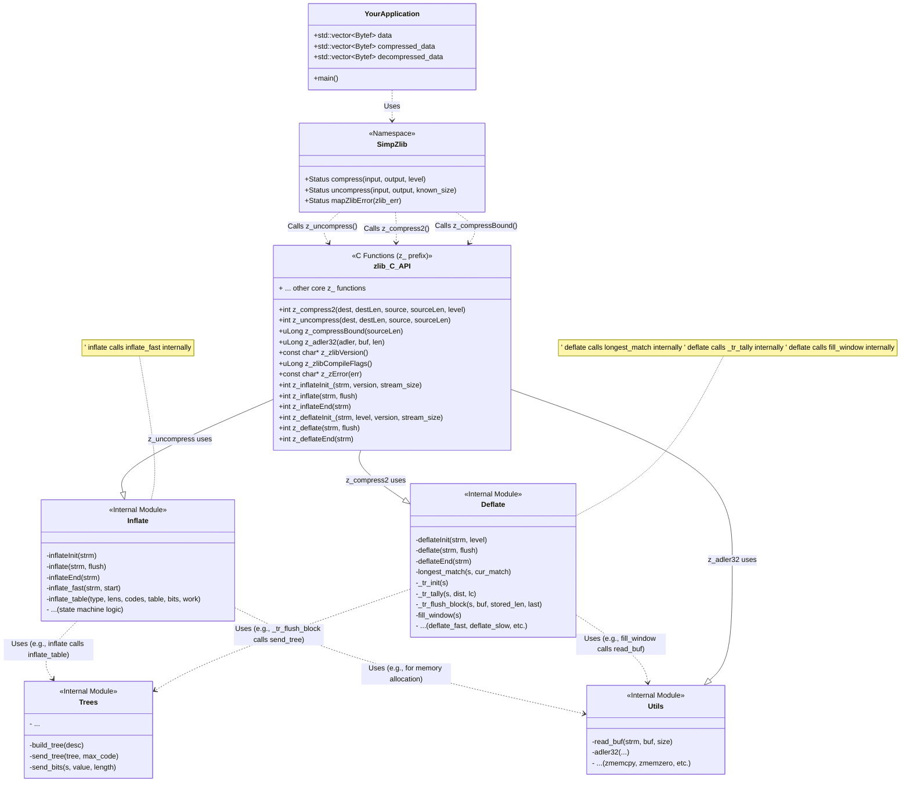

> This project uses modified zlib source code with conditional compilation (NO_GZIP option enabled).
> All original zlib copyright notices and license terms are preserved in both the source files and LICENSE.

> 该项目使用了修改条件编译的 zlib 源代码（启用了 NO_GZIP 选项）。
> 所有 zlib 源代码文件及 LICENSE 中均保留了原始的 zlib 版权声明和许可条款。

## 简介

本子目录是对 zlib 库核心压缩和解压缩功能的一个简化 C++ 封装。它旨在提供一个易于使用的接口，同时只包含必要的 zlib 源代码，以减小依赖体积，该封装仅作为TileWorld项目的依赖库使用，不推荐单独编译使用。

## 封装内容

*   **命名空间**: 所有封装函数和类型都位于 `SimpZlib` 命名空间下。
*   **核心功能**:
    *   `SimpZlib::compress()`: 使用 zlib 的 `compress2` 函数压缩 `std::vector<Bytef>` 数据。可以指定压缩级别。
    *   `SimpZlib::uncompress()`: 使用 zlib 的 `uncompress` 函数解压缩 `std::vector<Bytef>` 数据。需要提供原始未压缩数据的大小。
*   **状态码**: 定义了一个 `SimpZlib::Status` 枚举，用于映射 zlib 的返回码，使错误处理更清晰。
*   **数据类型**: 接口使用 `std::vector<Bytef>` (其中 `Bytef` 来自 `zlib.h`) 来处理二进制数据，并使用 `uLong` (来自 `zlib.h`) 表示大小。

## 条件编译

*   **`Z_PREFIX`**: 在 `CMakeLists.txt` 中，通过 `target_compile_definitions(zlibstatic PUBLIC Z_PREFIX)` 为 zlib 核心库 (`zlibstatic`) 添加了 `Z_PREFIX` 编译定义。这意味着所有 zlib 的全局符号（函数、类型等）都会被加上 `z_` 前缀（例如 `compress` 变为 `z_compress`）。这有助于避免在将此库集成到大型项目中时可能出现的命名冲突。封装代码 (`zlib_wrapper.cpp`) 内部通过 `::z_compress2` 等方式调用带前缀的 zlib 函数。本段文字仅作说明，实际上层代码编写中并不需要关注封装库如何调用zlib。

## 对原 zlib 库的删减

为了简化和减小体积，本项目在包含 zlib 源代码时进行了以下删减：

1.  **移除了 gzip 文件操作功能**: 相关的源文件（如 `gzlib.c`, `gzread.c`, `gzwrite.c`, `gzclose.c`）未被包含在编译中。封装层也不提供 gzip 文件读写接口。
2.  **移除了 CRC32 功能**: `crc32.c/h` 源文件未被包含。如果需要 CRC32 校验，需要自行实现。
3.  **移除了 zlib 示例和测试**: 原 zlib 库自带的 `examples/` 和 `test/` 目录内容未包含。
4.  **移除了部分工具函数**: 一些不直接被压缩/解压缩核心功能依赖的工具函数源文件可能未包含。
5.  **CMakeLists.txt 简化**: 移除了原 zlib CMake 配置中的测试、示例构建以及动态库生成选项。只保留了构建核心静态库 (`zlibstatic`) 和封装库 (`zlibwrapper`) 的逻辑。

## 如何在上层 CMake 项目中使用

推荐使用 `add_subdirectory` 将此项目作为子目录集成到你的主 CMake 项目中。

1.  **放置代码**: 将本目录（包含 `CMakeLists.txt`, `zlib/`, `zlib_wrapper.cpp`, `zlib_wrapper.h` 等）复制到你的项目源码树中。

2.  **修改你的根 `CMakeLists.txt`**:

    ```cmake
    # ... (你的项目设置) ...

    # 添加 SimpZlibProject 子目录
    # 假设本目录位于 <你的项目根目录>/libs/zlib-wrapper
    # 第二个参数是可选的，用于指定子项目的构建目录
    add_subdirectory(libs/zlib-wrapper ${CMAKE_CURRENT_BINARY_DIR}/zlib-wrapper-build)

    # ... (定义你的可执行文件或库目标, 例如 my_app) ...
    add_executable(my_app main.cpp ...)

    # 链接到 zlibwrapper 库
    # CMake 会自动处理 zlibwrapper 对 zlibstatic 的依赖
    # target_include_directories 会因为 zlibwrapper 的 PUBLIC 包含目录而自动处理
    target_link_libraries(my_app PRIVATE zlibwrapper)

    # ... (其他设置) ...
    ```

3.  **在你的 C++ 代码中包含头文件**:

    ```cpp
    #include "zlib_wrapper.h" // 路径相对于你的包含目录设置
    #include <vector>
    #include <iostream>

    int main() {
        std::vector<Bytef> data = {/* ... some data ... */};
        std::vector<Bytef> compressed_data;
        std::vector<Bytef> decompressed_data;

        // 压缩
        SimpZlib::Status status = SimpZlib::compress(data, compressed_data);
        if (status == SimpZlib::Status::OK) {
            std::cout << "Compression successful!" << std::endl;

            // 解压缩 (需要知道原始大小)
            uLong original_size = data.size();
            status = SimpZlib::uncompress(compressed_data, decompressed_data, original_size);

            if (status == SimpZlib::Status::OK) {
                std::cout << "Decompression successful!" << std::endl;
                // 验证 decompressed_data 是否与 data 相同
            } else {
                std::cerr << "Decompression failed!" << std::endl;
            }
        } else {
            std::cerr << "Compression failed!" << std::endl;
        }
        return 0;
    }
    ```

## UML 类图 (基于Mermaid)
